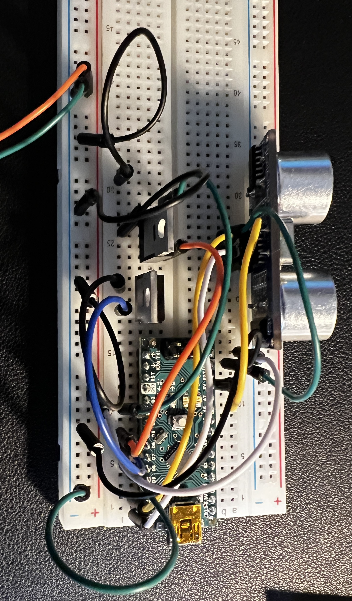
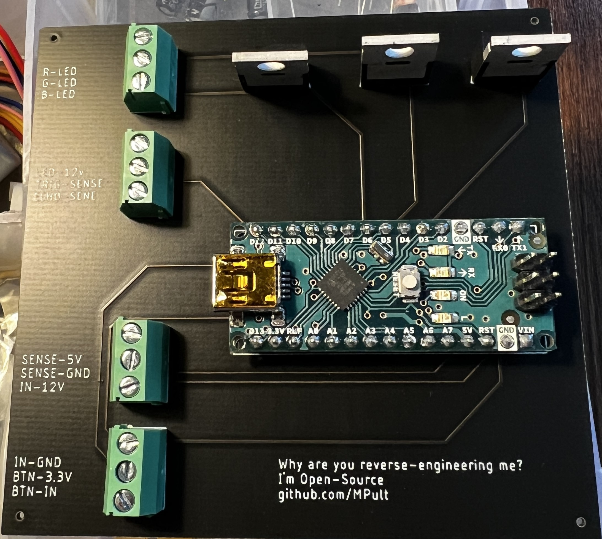

<!-- PROJECT LOGO -->
 

  

  <h3 align="center">Sydfly</h3>
  <h4>This is still under Developent</h4> 
  <h4> /syːd/ /flyːr/ </h4>
  

     LEDs for your PAX wardrobe, without the propriatary controller
    <!-- 
    <a href="https://github.com/mpult/sydfly">View Demo</a>
    ·
    <a href="https://github.com/mpult/sydfly/issues">Report Bug</a>
    ·
    <a href="https://github.com/mpult/sydfly/issues">Request Feature</a>
  
 -->

<!-- ABOUT THE PROJECT -->
## About The Project

<!-- [![Product Name Screen Shot][product-screenshot]](https://example.com) -->

I wanted to buy some LEDs, that turn off once I close the door, for my PAX wardrobe. Yet, the price tag convinced me to spend thousands in learning PCB design and creating my own. (No I'm not OK) 

Here's why you should use this:
* You value open-source over time efficiency
* You're a cheapskate
* You hate spending money on a product that actually fully works, so instead you make it yourself.

(<a href="#readme-top">back to top</a>)

<!-- GETTING STARTED -->
## Getting Started

Setting this up varies depending on how legit you want to make it: Own PCB? Or just on a breadboard?
### Parts list

Below is a list of parts required, each have their datasheet in the ``Datasheets`` folder. The links shown are for ``conrad.de``, I am not affiliated with them in any way.

| Count | Part No.                | Part Name                                                                                                                                       |
| ----- | ----------------------- | ----------------------------------------------------------------------------------------------------------------------------------------------- |
| 1     | A000005                 | [Arduino Nano](https://www.conrad.de/de/p/arduino-board-nano-core-nano-atmega328-1172623.html)                                                  |
| 4     | DG350-3.5-03P-14-00AH-1 | [Degson Screw Terminal](https://www.conrad.de/de/p/degson-dg350-3-5-03p-14-00ah-1-schraubklemmblock-2-mm-polzahl-num-3-gruen-1-st-1327185.html) |
| 3     | IRLB8721PBF             | [N-Channel MOSFET](https://www.conrad.de/de/p/infineon-technologies-irlb8721pbf-mosfet-1-n-kanal-65-w-to-220ab-161166.html)                     |
### Breadboard

1. Flash the code from ``Arduino-Code`` on to the Arduino [Instructions](https://support.arduino.cc/hc/en-us/articles/4733418441116-Upload-a-sketch-in-Arduino-IDE)
2. Build the breadboard following the [schematics](./Own-Schematics/Schematics.pdf), proper breadboard diagrams will follow soon (feel free to contribute!)
3. Enjoy the project!

**Optional Steps:**
1. 3D-Print the case from the ``CAD`` folder
2. Add a 45° diffuser for the stylish look

(<a href="#readme-top">back to top</a>)

### PCB Route

Okay so you're hardcore and want to make your own PCB.

You can either use the Gerber files from the release, or make your own. Instructions to make the gerber files will follow soon™

1. Upload the **zipped** Gerber files from the release.
2. Select the options you want, only really important is 2 layered PCB. Rest is all preference
3. Order and wait.
4. Solder the components to the board following the [board Diagram](./Own-Schematics/Board.pdf)
5. Flash the code from ``Arduino-Code`` on to the Arduino [Instructions](https://support.arduino.cc/hc/en-us/articles/4733418441116-Upload-a-sketch-in-Arduino-IDE)
6. Done!

**Optional Steps:**
1. 3D-Print the case from the ``CAD`` folder
2. Add a 45° diffuser for the stylish look

(<a href="#readme-top">back to top</a>)

<!-- ROADMAP -->
## Roadmap

- [x] New README
- [x] Create Release
- [ ] Add multithreading
- [x] Add images to docs.

See the [open issues](https://github.com/mpult/sydfly/issues) for a full list of proposed features (and known issues).

(<a href="#readme-top">back to top</a>)

<!-- CONTRIBUTING -->
## Contributing

Contributions are what make the open source community such an amazing place to learn, inspire, and create. Any contributions you make are **greatly appreciated**.

If you have a suggestion that would make this better, please fork the repo and create a pull request. You can also simply open an issue with the tag "enhancement".
Don't forget to give the project a star! Thanks again!

1. Fork the Project
2. Create your Feature Branch (`git checkout -b feature/AmazingFeature`)
3. Commit your Changes (`git commit -m 'Add some AmazingFeature'`)
4. Push to the Branch (`git push origin feature/AmazingFeature`)
5. Open a Pull Request

(<a href="#readme-top">back to top</a>)

<!-- LICENSE -->
## License

Distributed under the MIT License. See `LICENSE` for more information.

(<a href="#readme-top">back to top</a>)

<!-- ACKNOWLEDGMENTS -->
## Acknowledgments

* [Choose an Open Source License](https://choosealicense.com)
* [Img Shields](https://shields.io)
* [Markdown Template](https://github.com/othneildrew/Best-README-Template)
* [PCBway](https://pcbway.com)

# PCBway Review.

PCBway is the sponsor for this project!

**Disclaimer: I received the SYDFLY PCB prototype from PCBWay for free in exchange for writing this review.**

When it comes to open-source PCB projects, the quality of the prototypes can make a significant difference in the overall success of your project. I recently had the opportunity to try out PCBWay's services for the SYDFLY project, and I must say I'm quite impressed with the experience.

The continued collaboration with PCBWay has made the delevopment of this project possible. The service is honestly incredible, over multiple orders with them the quality has remained excelent. A coupple weeks after a order arrives a representative will reach out and ensure that everything is perfect.

Packaging:
First impressions matter, and PCBWay started off on the right foot with their packaging. The PCBs were carefully wrapped in bubble wrap and vacuum-sealed, ensuring that they arrived in pristine condition. This level of care in packaging demonstrates a commitment to quality and customer satisfaction.

Quality Assurance:
Upon opening the package, I examined the PCBs closely for defects. I'm pleased to report that there were none to be found. The boards looked immaculate, and the solder mask and silkscreen printing were sharp and well-executed. I also conducted a thorough conductivity and shorts check, and everything passed with flying colors. This attention to detail and quality control is crucial.

Finish Selection:
One important piece of advice I'd like to share is the importance of choosing the right finish for your PCBs. PCBWay offers a variety of finish options, and it's essential to select the one that suits your project. In my experience, the lead-free finish worked perfectly. However, it's worth noting that if you're not familiar with different finishes, seeking guidance is advisable to ensure compatibility with your components.

Shipping Speed and Cost:
I was pleasantly surprised by the efficiency of PCBWay's shipping service. Not only was it faster, but it was also more cost-effective compared to my previous experience with another PCB manufacturer. This is a significant advantage for anyone looking to get their prototypes quickly without breaking the bank.

Overall Impressions:
In conclusion, my experience with PCBWay for the SYDFLY project has been overwhelmingly positive. The quality of the PCBs, the attention to detail, and the reliable shipping service all contribute to an excellent overall experience. It's worth noting that the quality is on par with some of other well-known PCB manufacturers, which speaks volumes about PCBWay's capabilities.

In the interest of full transparency, I did receive these SYDFLY PCB prototypes from PCBWay at no cost in exchange for this review. However, I want to emphasize that my assessment is based solely on the quality of the product and the overall experience.

If you're working on an open-source PCB project like SYDFLY, I highly recommend giving PCBWay a try. Their commitment to quality, fast and affordable shipping, and range of finish options make them a strong contender in the PCB manufacturing space.

<!-- MARKDOWN LINKS & IMAGES -->
<!-- https://www.markdownguide.org/basic-syntax/#reference-style-links -->

[product-screenshot]: images/screenshot.png
